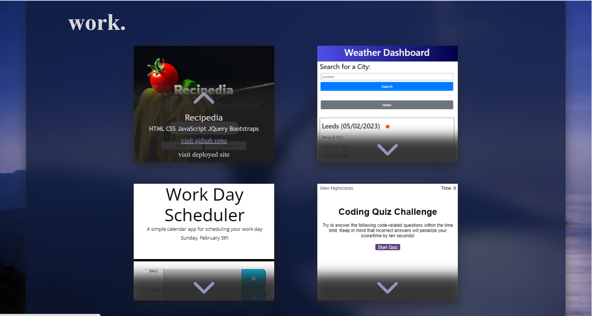
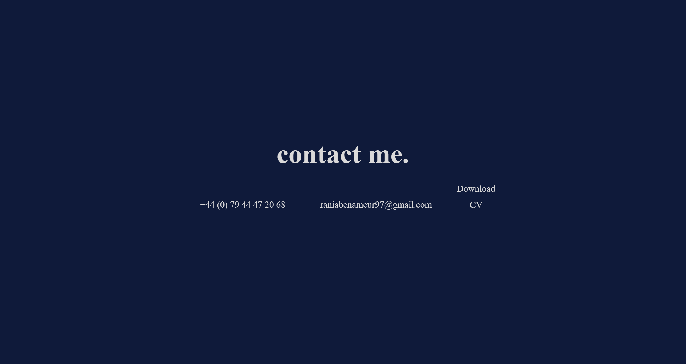
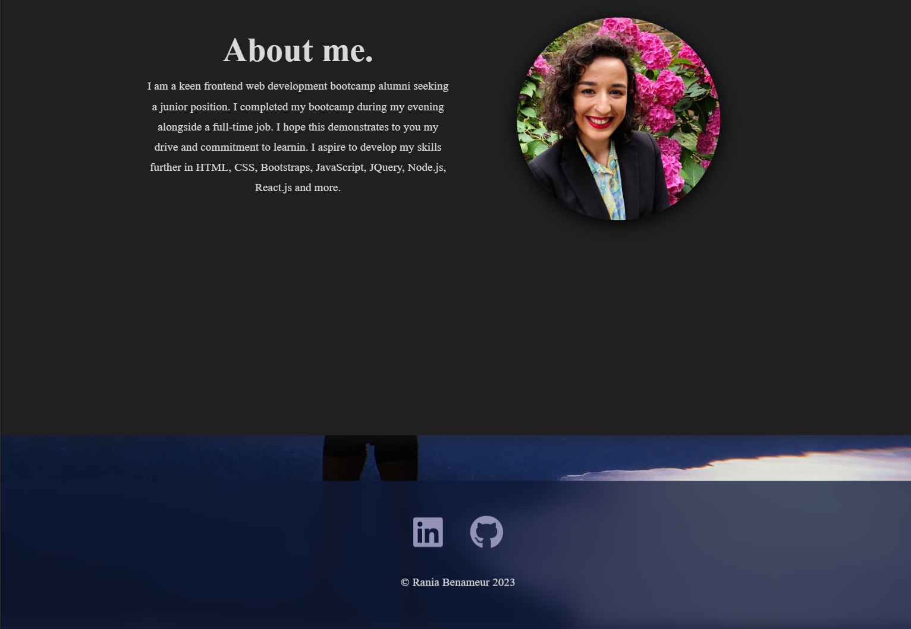

# Rania-Benameur-Portfolio-React
Description
Portfolio of Rania Benameur, written React.js to showcase skills gained from 16 week front-end web development bootcamp.

Sections include:

Home
Work including links to github repo's for four projects and the url to their live site
Contact including phone number and email and downloadable CV
Footer including links to linkedin and github profile

Installation
Download the files locally and npm install to download all relevant libraries. npm start from the 'my-react-app' folder.

Usage
Download the repo locally to run the portfolio [URL of the github repo](https://github.com/RBenameur/Rania-Benameur-Portfolio-React).

Click links above to navigate to Rania Benameur's portfolio. Use the nav bar to quickly navigate to relevant sections. By hovering above the project cards, some information including: project name, technologies used and a link to github repo and deployed URL will be visible. By clicking the link to the github repo or deployed, it will open in a new tab.

Phone number and email are available to copy (Ctrl + C for windows or CMD + C for mac) and paste (Ctrl + V for windows or CMD + V for mac) should you wish to get in touch with Rania Benameur regarding opportunites. Additionally you can download of copy of their CV by clicking 'download CV'

Links to Rania Benameur's Linkedin profile and github profile are available in the footer section.

Screenshot of Home page

Screenshot of Work Section

Screenshot of Contact Section

Screenshot of Footer Section

Credits
N/a

License
Please refer to the LICENSE in the repo.
